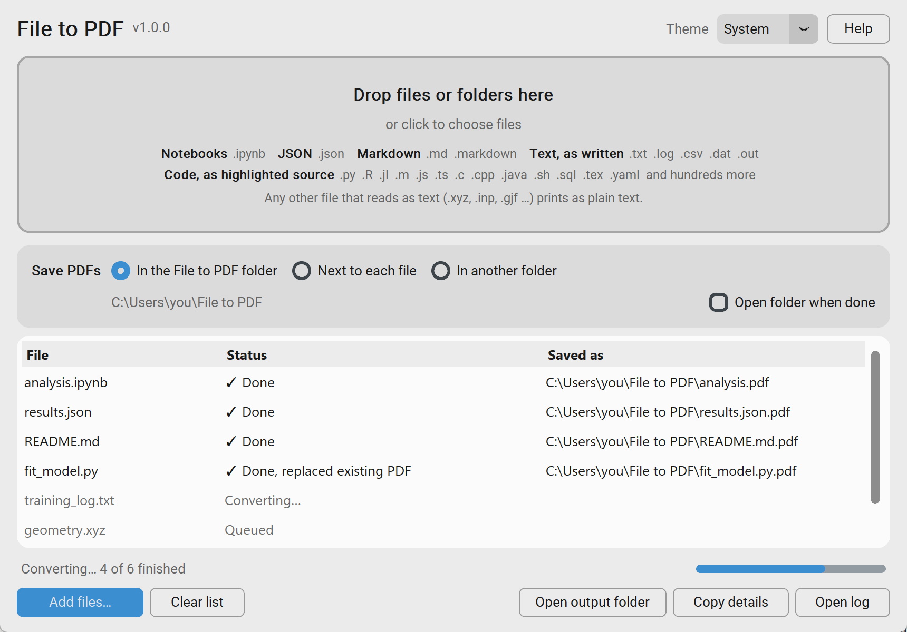

# File to PDF

[](https://github.com/PrashantKumarChem/file-to-pdf/releases/latest)
[](https://github.com/PrashantKumarChem/file-to-pdf/actions/workflows/tests.yml)
[](https://github.com/PrashantKumarChem/file-to-pdf/actions/workflows/lint.yml)
[](pyproject.toml)
[](#download)
[](LICENSE)

**Turn Jupyter notebooks, JSON, Markdown, code and text files into clean PDFs
on Windows. Drop them on the window, or convert whole folders from the
command line.**

<p align="center">
  
</p>

## Why it exists

Getting a notebook or a data file into a PDF usually goes wrong in one of a
few ways:

- `jupyter nbconvert --to pdf` needs a LaTeX installation.
- `nbconvert --to webpdf` avoids LaTeX, but long code lines, wide output
  tables and wide figures are cut off at the right edge of the page.
- Printing JSON, code or text from a browser or an editor adds page headers,
  file paths and dates, or loses the formatting.

File to PDF uses nbconvert's web PDF route with a bundled template that wraps
long lines and scales wide output to fit the page, so nothing is cut off and
no LaTeX is needed. Every other file prints **1:1**: the PDF holds the file's
content and nothing else, with no added heading, file name or page furniture.
It's useful when a PDF has to be handed in, attached or archived: course
submissions, supporting information, lab records.

## Download

Get **`FileToPDF-windows.zip`** (about 200 MB) from the
[latest release](https://github.com/PrashantKumarChem/file-to-pdf/releases/latest).
It includes Python and Chromium, so nothing else needs installing.

1. Unzip it to a short path, such as `C:\Users\<you>\Downloads\FileToPDF`.
   Keep the folder's own path under about 120 characters (see
   [Good to know](#good-to-know)).
2. Run `File to PDF.exe`. The programs are unsigned, so Windows SmartScreen
   asks before the first run: choose **More info → Run anyway**.
3. Drop files or folders on the window. PDFs go to `%USERPROFILE%\File to PDF`
   unless you choose otherwise.

For scripts and batches, `topdf.exe` in the same folder is the
[command line](#command-line).

## What it converts

| File | How it prints |
| --- | --- |
| Jupyter notebooks (`.ipynb`) | As nbconvert renders them, with long code lines wrapped and wide tables and figures scaled to fit the page |
| JSON (`.json`) | Highlighted exactly as written: never parsed and re-serialized, so key order, indentation and numbers such as `1.0` stay as they are |
| Markdown (`.md`, `.markdown`) | As the rendered document, with highlighted code blocks |
| Code (`.py`, `.R`, `.jl`, `.m`, `.js`, `.c`, `.java`, `.sql`, `.tex`, `.yaml` and hundreds more) | As highlighted source. `.html` and `.tex` give the markup, not the rendered page |
| Text (`.txt`, `.log`, `.csv`, `.dat`, `.out`) | As written. A `.csv` prints its lines, not a table |
| Anything else that reads as text (`.xyz`, `.inp`, `.gjf` …) | As plain text |

Binary files such as images fail with a message instead of printing garbage.
Text is read as UTF-8, UTF-16 or UTF-32 (by byte-order mark) or cp1252.

Links to files on your computer print without their target, so no local
folder path ends up inside a PDF. Web links stay clickable.

## Using the window

- **Add files** by dropping files or folders anywhere on the window, clicking
  the drop area, pressing Ctrl+O or using **Add files**. A dropped folder adds
  the files in it that print (not its subfolders) and says how many it left
  out. Keep adding files while others convert.
- **Choose where PDFs go:** the File to PDF folder, next to each file, or
  another folder. The choice applies to files added after you change it.
- **Follow progress** in the list. Each file is marked ✓ done, ⚠ saved with a
  warning or ✕ failed, with the path of its PDF, and a progress bar shows how
  much of the batch is finished.
- **Open results:** double-click a file to open its PDF, or right-click for
  Open PDF, Show in folder, Copy details and Remove from list.
- **Get help:** every control explains itself when the pointer rests on it,
  and **Help** (F1) lists everything, including the keyboard shortcuts.

Delete removes the selected rows, Ctrl+C copies a row's details and Ctrl+A
selects every row. Removing a row, or **Clear list**, skips files that haven't
started yet. The output choice, "Open folder when done" and the theme last
until the window closes.

## Command line

`topdf` converts files, folders and wildcards the same way as the window:

```
topdf analysis.ipynb data\*.json
topdf "C:\Projects\results" --recursive --next-to-source
topdf notes.md --out C:\PDFs
```

It is `topdf.exe` in the app's folder; from source, run
`uv run python -m topdf` with the same arguments. `topdf --help` lists the
options.

- **Inputs.** A file named directly always converts; unknown types print as
  text. A folder converts every file that prints and lists what it skipped:
  images and other binary files, PDFs (so an earlier `--next-to-source` run
  isn't printed again) and hidden entries such as `.ipynb_checkpoints`.
  `--recursive` includes subfolders. Wildcards work in both cmd and
  PowerShell.
- **Output.** PDFs go to `%USERPROFILE%\File to PDF` unless `--out FOLDER` or
  `--next-to-source` says otherwise.
- **Result.** Each file prints one status line. The exit code is 0 when
  everything converted, 1 when a file failed or a path matched nothing, and 2
  when there was nothing to convert. `--version` prints the version.

## Good to know

- **Windows only.** The app and its tests target Windows.
- **Letter paper.** Pages are US Letter: 0.6 in margins for files, 0.1 in for
  notebooks. There is no A4 option.
- **Notebooks load a few things from the web.** Printing a notebook fetches
  MathJax and require.js from cdnjs, and chart outputs (Altair/Vega) fetch
  their libraries from jsdelivr, as nbconvert's pages always do. Your files are
  converted on your computer and never uploaded. Offline, the PDF is still
  saved, but math or charts may be missing and the status starts with
  "Warning: … web resources did not load".
- **Short unzip path.** Chromium sits about 135 characters deep inside the
  app folder, and Windows won't start a program whose path is 260 characters
  or longer. A deeply nested or synced folder may be too long; if it is,
  conversions fail with a message saying so.
- **Unsigned.** SmartScreen asks before the first run.

<details>
<summary><strong>More detail: file names, the fallback folder, batches and the log</strong></summary>

- **Names.** `analysis.ipynb` becomes `analysis.pdf`; other files keep their
  extension (`analysis.json.pdf`). Converting the same file again replaces
  its PDF, and the status says "replaced existing PDF". A different file that
  would produce the same name in the same session gets a numbered name such as
  `analysis.json (2).pdf`. PDFs from earlier sessions aren't tracked, so a
  same-named one is replaced. Each command-line run is a new session, so
  convert same-named files in one run to keep both.
- **Fallback folder.** If the chosen folder refuses the write, the PDF goes to
  `Desktop\File to PDF - could not save` and the file is marked ⚠.
- **JSON colors.** The palette is deliberately muted for pages of long string
  values: bold maroon keys, green strings, purple `true`/`false`/`null`, and
  numbers and punctuation in the text color. Code files and Markdown code
  blocks use the same palette. Plain text files print unhighlighted.
- **Local links.** In Markdown files they print as plain text; in notebooks
  they keep the link color but lose their target.
- **Batches.** Files queued together (a drop, a multi-select, one
  command-line run) share one Chromium, which closes as soon as the queue is
  empty. If Chromium or its Playwright driver stops partway, both are
  restarted and that file is tried once more.
- **Log.** Each conversion is appended to
  `%LOCALAPPDATA%\File to PDF\conversion_log.txt`, which moves to
  `conversion_log.old.txt` past 1 MB. **Open log** in the window opens it. It
  records the full path of every converted file.

</details>

## Running from source

1. Install [uv](https://docs.astral.sh/uv/getting-started/installation/),
   then clone the repository and install Python, the dependencies and the
   Chromium build Playwright uses:

   ```
   git clone https://github.com/PrashantKumarChem/file-to-pdf.git
   cd file-to-pdf
   uv sync
   uv run python -m playwright install chromium
   ```

   uv installs the Python version in `.python-version` (3.14) and the exact
   package versions in `uv.lock` into `.venv`, the same ones the tests and the
   Windows app use.

2. Start the window with `uv run python -m topdf.gui`, or double-click
   `File to PDF.vbs`, which starts it without a console window.

Run the tests with `uv run python -m pytest` (about 30 seconds), or add
`-m "not slow"` to skip the Chromium and nbconvert rendering tests. The GUI
tests open a hidden window, so run them from a desktop session.

<details>
<summary><strong>Building the Windows app</strong></summary>

GitHub Actions builds the app with PyInstaller (`packaging/topdf.spec`,
workflow `.github/workflows/build.yml`) and checks it with
`packaging/smoke_test.py`. Pushing a `v*` tag publishes a release with
`FileToPDF-windows.zip` attached; a run started by hand keeps the zip as a
workflow artifact for 7 days.

To build it on your own machine (PowerShell, from the repository folder):

```
uv sync --group packaging
$env:PLAYWRIGHT_BROWSERS_PATH = "0"; uv run python -m playwright install --only-shell chromium
uv run python -m PyInstaller --noconfirm packaging/topdf.spec
uv run python packaging/smoke_test.py dist/FileToPDF
```

The app folder includes `LICENSE.txt` and `THIRD-PARTY-NOTICES.txt`, which
give the licenses of the app and of everything it bundles.

</details>

## Project status

File to PDF is **parked**: it's maintained for the author's own use, with no
new features planned. Bug reports and small fixes are welcome (see
[CONTRIBUTING.md](CONTRIBUTING.md)), and so is forking it. Report security
problems privately as described in [SECURITY.md](SECURITY.md). Changes are
listed in [CHANGELOG.md](CHANGELOG.md).

## How this was built

File to PDF was built with Claude Code, Anthropic's coding assistant, with
every change reviewed and tested by the maintainer.
[AI_USAGE.md](AI_USAGE.md) describes how.

## Citing

If you use File to PDF in your work, the "Cite this repository" button on
GitHub gives a citation from [CITATION.cff](CITATION.cff).

## License

[MIT](LICENSE). The Windows app bundles Python, Chromium and other
open-source components, each under its own license; its
`THIRD-PARTY-NOTICES.txt` lists them.
